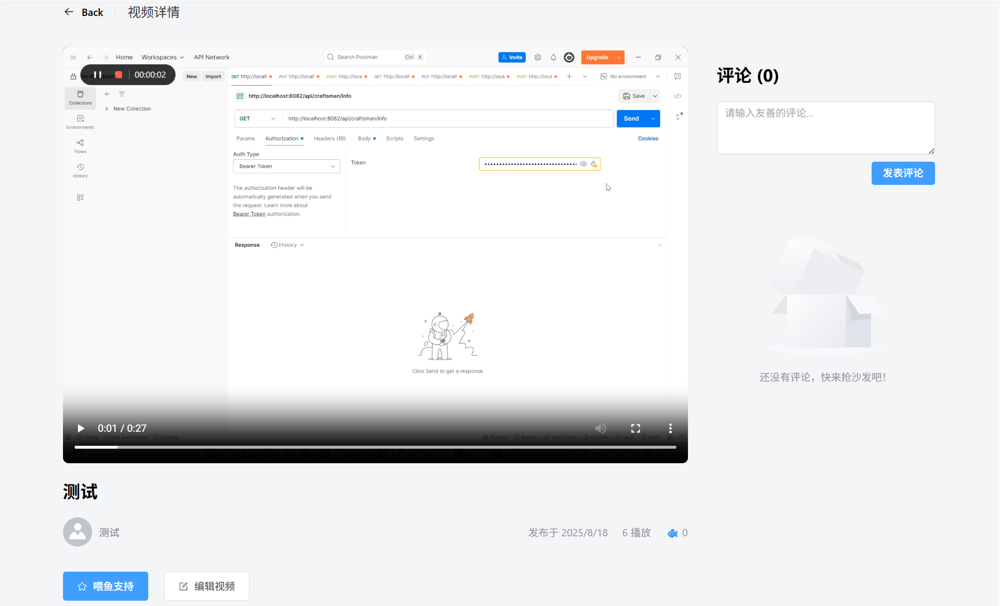
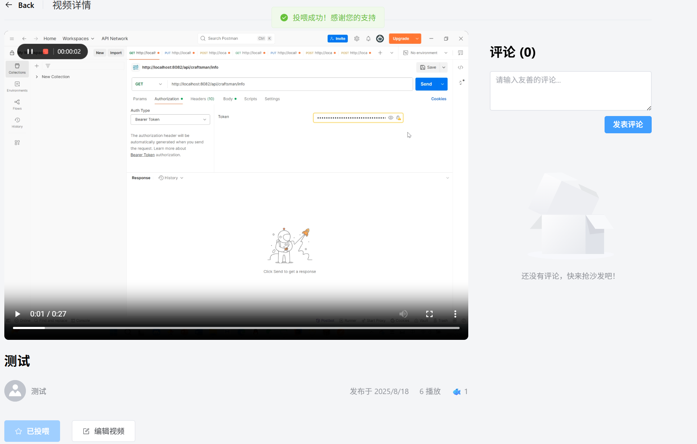
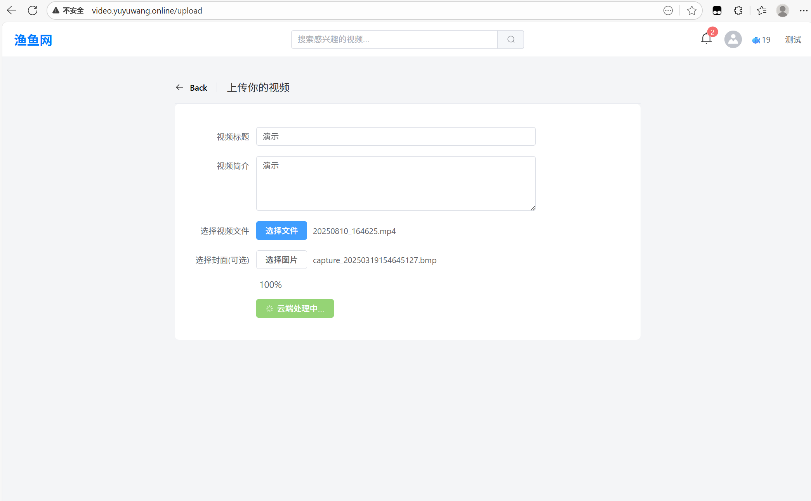
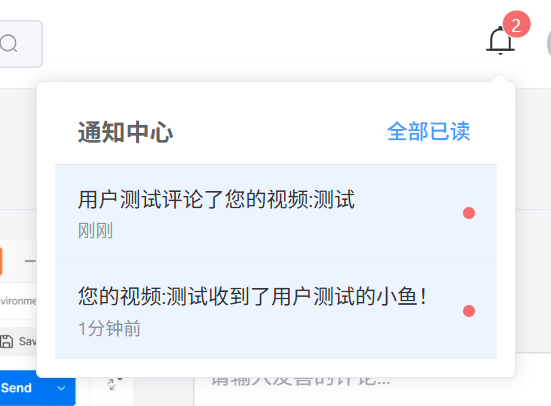
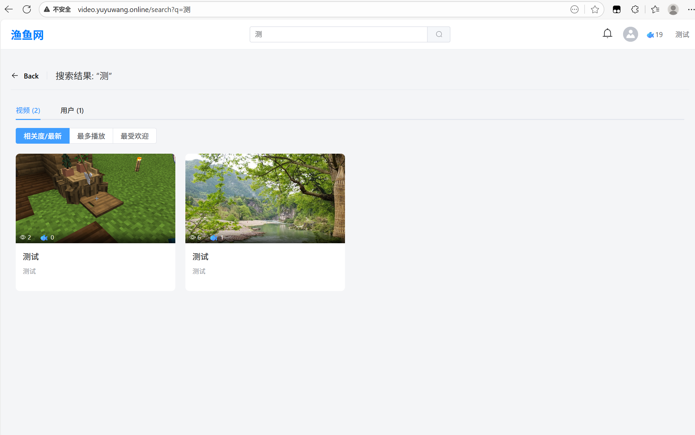
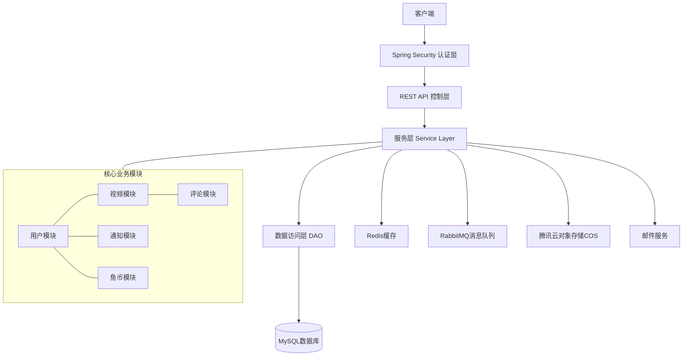

# 渔鱼网（YuYuWang）- 视频分享平台后端

渔鱼网是一个功能完备的视频分享平台，本仓库包含该平台的后端服务代码。该项目已成功部署上线，为用户提供视频上传、观看、评论和互动功能，并实现了"鱼币"虚拟货币系统，增强用户之间的互动性。
<<<<<<< HEAD

## 项目地址

**在线访问地址：** [video.yuyuwang.online](http://video.yuyuwang.online)

## 项目展示

以下是系统的部分功能界面展示：










=======
>>>>>>> 525dd0162e5e8ea515b3a5d01c0fb1ab62d9660c

## 项目概述

渔鱼网是一个视频分享社区平台，用户可以上传和分享自己的视频作品，其他用户可以观看、评论和通过"投喂小鱼"（点赞）的方式互动。平台融合了社交网络的元素，让创作者和观众之间的互动更加生动有趣。

### 核心特色

- **视频内容分享**：用户可以上传、管理和分享视频内容
- **鱼币系统**：平台独特的虚拟货币系统，用户可以通过每日签到获得鱼币，用于给喜欢的视频"投喂"
- **社区互动**：评论系统、通知系统支持用户之间的互动
- **高性能架构**：基于Spring Boot构建，结合Redis缓存、RabbitMQ消息队列等技术，保证系统高并发处理能力
- **云存储集成**：接入腾讯云对象存储服务(COS)，高效管理视频和图片资源

## 技术栈

后端技术栈：

- **核心框架**：Spring Boot 3.4.7
- **安全框架**：Spring Security + JWT
- **持久层**：MyBatis
- **数据库**：MySQL
- **缓存**：Redis (Redisson)
- **消息队列**：RabbitMQ
- **对象存储**：腾讯云COS
- **其他**：
  - PageHelper（分页插件）
  - Lombok（简化开发）
  - Spring Mail（邮件服务）

## 系统架构

系统采用经典的多层架构设计：



## 主要功能

### 用户模块

- **账户管理**：注册、登录、修改个人资料
- **安全认证**：基于JWT的用户认证和授权
- **个人主页**：展示用户信息和上传的视频
- **邮件验证**：注册时的邮箱验证码功能
- **鱼币系统**：每日签到获取鱼币，用于视频互动

### 视频模块

- **视频管理**：上传、编辑、删除视频
- **视频浏览**：分页查询、排序（最新、最热）
- **视频搜索**：基于关键词的视频搜索
- **封面管理**：自定义视频封面

### 评论模块

- **评论管理**：发表、查看评论
- **互动功能**：回复评论

### 通知模块

- **实时通知**：新评论、获得鱼币等消息通知
- **消息中心**：查看历史通知

### 鱼币模块

- **虚拟货币**：平台内虚拟货币系统
- **交易记录**：记录鱼币的获取和使用

## 项目结构

项目采用标准的Maven项目结构，主要包含以下目录：

```
src/main/java/com/example/videoapp/
├── common         # 通用工具类、响应对象等
├── config         # 配置类（Redis、RabbitMQ、Security等）
├── controller     # 控制器层，处理HTTP请求
├── DTO            # 数据传输对象
├── entity         # 实体类，对应数据库表结构
├── exception      # 异常处理
├── filter         # 过滤器（如JWT认证过滤器）
├── mapper         # MyBatis映射接口
├── service        # 业务逻辑层
└── VideoappApplication.java  # 应用程序入口
```

## API接口概览

系统提供RESTful风格的API接口，主要包括：

### 用户相关

- `POST /api/users/register` - 用户注册
- `POST /api/users/login` - 用户登录
- `GET /api/users/me` - 获取当前用户信息
- `PATCH /api/users/me` - 更新用户信息
- `POST /api/users/me/avatar` - 更新用户头像
- `POST /api/users/me/password` - 修改密码
- `POST /api/users/me/claim-daily` - 领取每日奖励
- `GET /api/users/{username}` - 获取指定用户信息
- `GET /api/users/{userId}/videos` - 获取用户上传的视频

### 视频相关

- `POST /api/videos/upload` - 上传视频
- `GET /api/videos` - 获取视频列表
- `GET /api/videos/{videoId}` - 获取视频详情
- `GET /api/videos/search` - 搜索视频
- `DELETE /api/videos/{videoId}` - 删除视频
- `PATCH /api/videos/{videoId}` - 更新视频信息
- `POST /api/videos/{videoId}/feed` - 给视频投喂鱼币

### 评论相关

- `POST /api/comments` - 发表评论
- `GET /api/comments/video/{videoId}` - 获取视频的评论列表
- `DELETE /api/comments/{commentId}` - 删除评论

### 通知相关

- `GET /api/notifications` - 获取当前用户的通知
- `PATCH /api/notifications/{notificationId}/read` - 标记通知为已读
- `PATCH /api/notifications/read-all` - 标记所有通知为已读

## 部署与环境配置

系统支持多环境配置，包括开发环境和生产环境。

### 环境变量

系统使用以下环境变量进行配置，确保在运行前正确设置：

**开发环境变量：**
- `DB_USERNAME` - 开发环境数据库用户名
- `DEV_DB_PASSWORD` - 开发环境数据库密码
- `RABBITMQ_USERNAME` - RabbitMQ用户名
- `DEV_RABBITMQ_PASSWORD` - 开发环境RabbitMQ密码
- `TENCENT_COS_SECRET_ID` - 腾讯云COS SecretId
- `TENCENT_COS_SECRET_KEY` - 腾讯云COS SecretKey
- `TENCENT_COS_BUCKET_NAME` - 腾讯云COS存储桶名称
- `TENCENT_COS_REGION` - 腾讯云COS地域
- `MAIL_USERNAME` - 邮箱地址
- `MAIL_PASSWORD` - 邮箱授权码
- `JWT_SECRET` - JWT签名密钥

**可选环境变量（有默认值）：**
- `DB_HOST` - 数据库主机地址，默认为127.0.0.1
- `DB_PORT` - 数据库端口，默认为3306
- `DB_NAME` - 数据库名称，默认为videoapp
- `REDIS_HOST` - Redis主机地址，默认为localhost
- `REDIS_PORT` - Redis端口，默认为16379
- `RABBITMQ_HOST` - RabbitMQ主机地址，默认为localhost
- `RABBITMQ_PORT` - RabbitMQ端口，默认为5672
- `MAIL_HOST` - 邮件服务器地址，默认为smtp.qq.com
- `MAIL_PORT` - 邮件服务器端口，默认为587

**生产环境变量：**
- `PROD_DB_PASSWORD` - 生产环境数据库密码
- `PROD_RABBITMQ_PASSWORD` - 生产环境RabbitMQ密码

### 快速开始（本地开发）

1. **克隆项目**
```bash
git clone https://github.com/ikun0731/videoapp-backend.git
cd videoapp-backend
```

2. **启动开发环境依赖服务（Redis和RabbitMQ）**
```bash
docker-compose up -d
```

3. **配置环境变量**

创建`.env`文件并设置必要的环境变量：
```
DB_USERNAME=your_db_username
DEV_DB_PASSWORD=your_db_password
RABBITMQ_USERNAME=guest
DEV_RABBITMQ_PASSWORD=guest
JWT_SECRET=your_jwt_secret
# 根据需要设置其他变量
```

4. **运行应用**
```bash
./mvnw spring-boot:run -Dspring-boot.run.profiles=dev
```

### 生产环境部署

1. **构建项目**
```bash
./mvnw clean package -DskipTests
```

2. **部署JAR文件**
```bash
java -jar target/videoapp-0.0.1-SNAPSHOT.jar --spring.profiles.active=prod
```

3. **或使用Docker部署（可选）**
```bash
docker build -t videoapp .
docker run -d -p 8081:8081 --env-file .env.prod --name videoapp-container videoapp
```

## 功能亮点

1. **智能视频内容管理**：设计并实现了完整的视频生命周期管理流程，采用异步处理机制优化视频上传响应时间，提升用户上传体验。

2. **腾讯云对象存储集成**：二次封装腾讯云COS SDK，实现了高效的分块上传和资源管理，支持单文件最大2GB的视频上传，为项目提供了可靠的云存储解决方案。

3. **鱼币投喂系统**：设计并实现了类似B站的"投币"功能，用户可通过每日签到获取鱼币并"投喂"喜爱的视频，使用Redisson分布式锁保证并发场景下的数据一致性。

4. **实时消息通知系统**：基于RabbitMQ实现了消息的可靠投递和消费重试机制，确保系统通知的及时性和可靠性，增强用户互动体验。

5. **高效缓存架构**：引入Redis+Redisson实现了针对热点数据(如视频详情、用户信息等)的缓存策略，有效减少数据库访问压力，优化接口响应时间。

6. **安全认证机制**：基于JWT+Spring Security实现了无状态身份认证系统，支持token自动续期和黑名单机制，增强系统安全性的同时降低服务器内存占用。

7. **邮件服务集成**：设计基于异步处理的邮件发送系统，支持邮箱验证码和通知功能，提升系统功能完整性和用户注册体验。

## 未来规划

1. **视频推荐系统**：基于用户行为和喜好的智能推荐
2. **实时弹幕系统**：增强视频观看的互动体验
3. **社交关系网络**：实现关注、粉丝等社交功能
4. **更丰富的内容标签**：增强内容发现和分类功能
5. **移动端适配优化**：提升移动设备的用户体验

## 作者信息

渔鱼网后端系统由作者独立开发完成，展示了对Java后端开发、微服务架构和云服务集成的全面理解和实践能力。

---

*注：本项目已上线部署，欢迎联系了解更多细节。*
